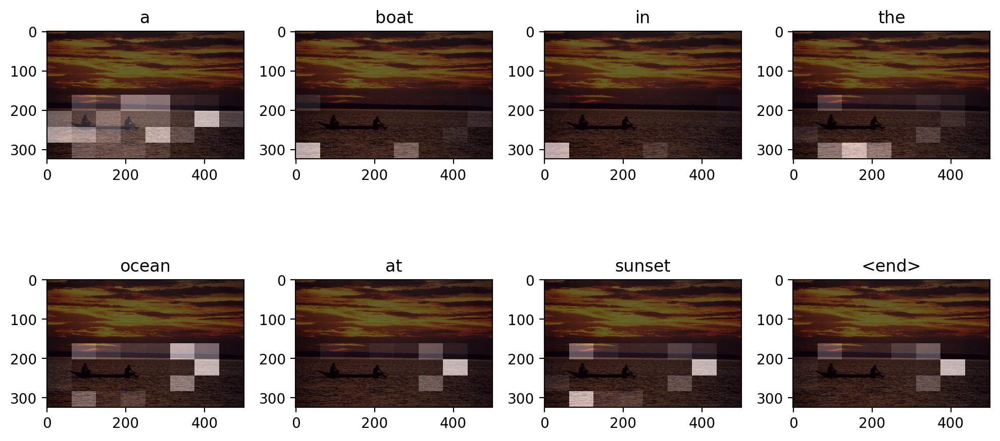
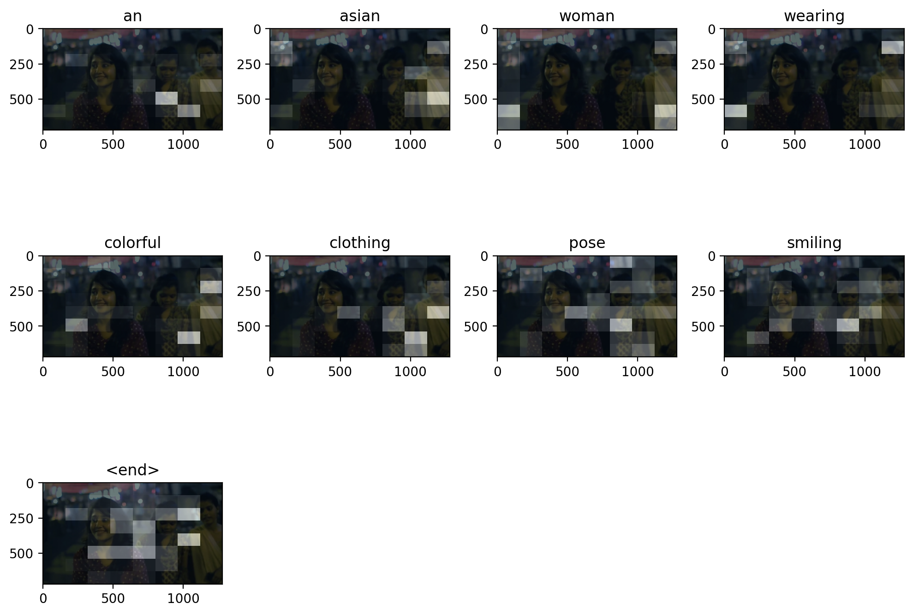
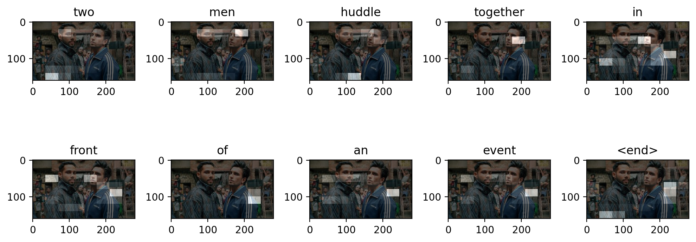
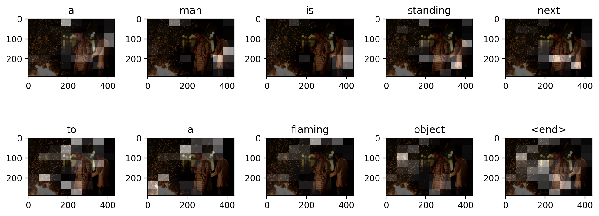
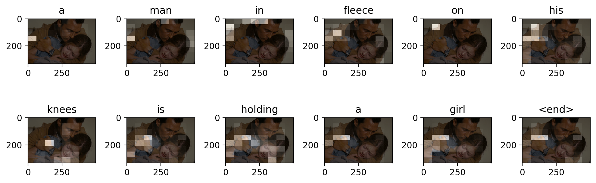
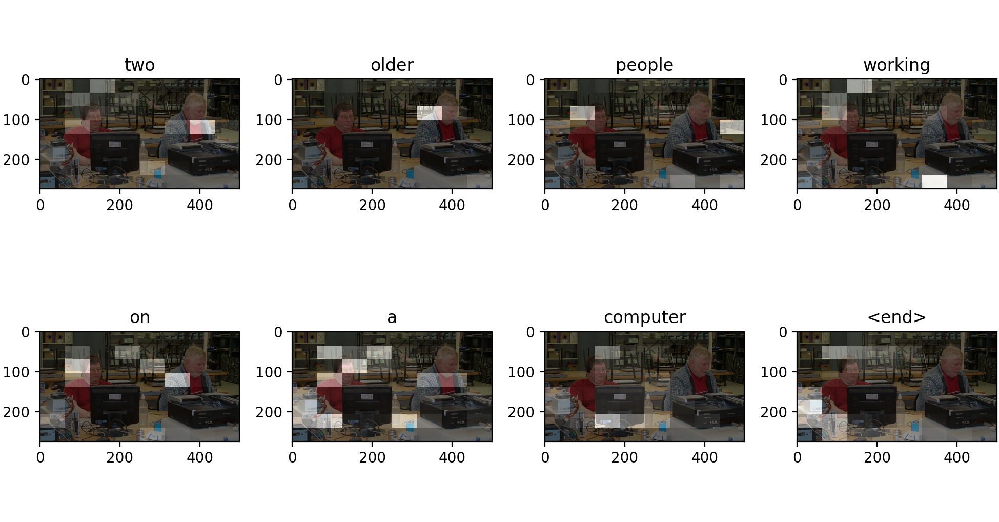
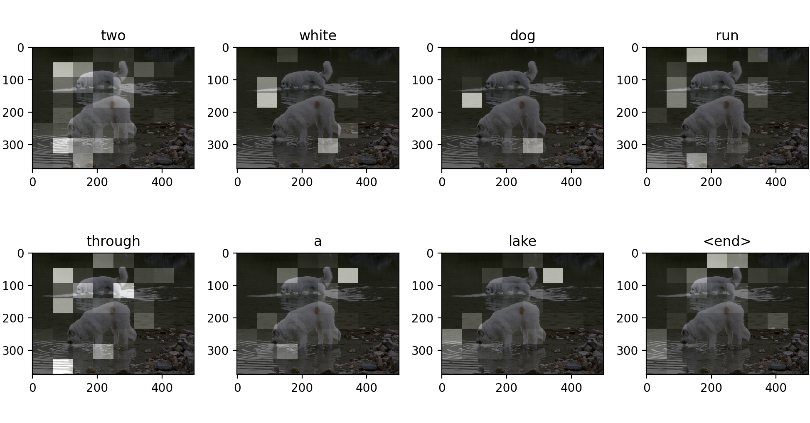
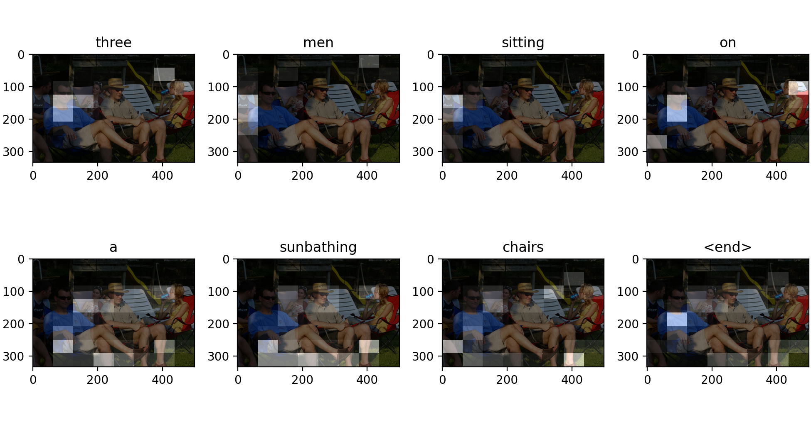

# IMcap
Inspired from the paper "Show Attend and Tell". This project's aim was to train a neural network which can provide descriptive text for a given image.

## Overview
Architecture bascially consists of encoder-decoder Neural Network, where encoder extracts feature from the image and decoder interprets those features to produce sentence.

Encoder consists of a pre-trained Inception-V3 model (minus the last Fully Connected layers) appended by a custom Fully Connected layer.
Decoder consists of LSTM along with visual-attention. Visual attention helps LSTM in focussing on relevent image features for the prediction of a particular word in word sequence (sentence)

For word embeddings, a custom word2vec model was trained and it was then intersected with Google's pre-trained word2vec model.

Google-colab and google drive combo was used for training the model.
Flickr30 Dataset was used for creating train and test sets.

A number of models were trained (each trained on different no of images). Of these, version 5 model performs the best.
You can access these models from "models" sub-directory inside "ImageCap" directory

## Technologies used

InceptionV3, LSTM, visual-attention, Word2Vec

## Libraries used

Tensorflow, Keras, Gensim, Numpy, Pandas, Sklearn, Pickle, Pillow, Matplotlib, ast, os

## Results

Following are some of the results. You can look at some more results in the Evaluate.ipynb 

